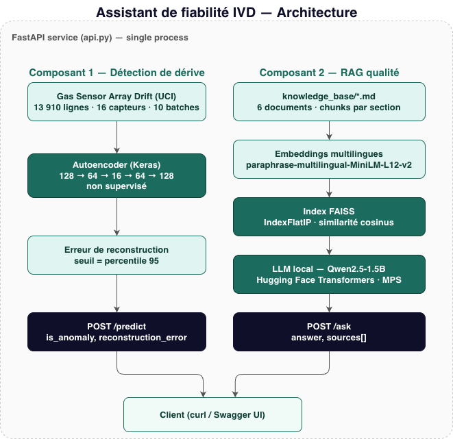
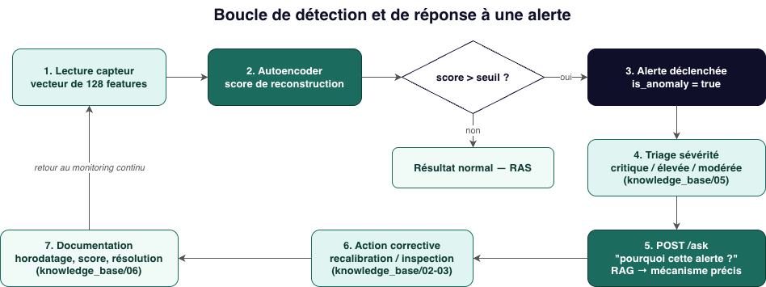

# Assistant de fiabilité IVD — Drift Detection & RAG


Prototype combining deep learning drift detection and a local LLM-powered RAG
assistant for IVD (in vitro diagnostics) system reliability.
Two components: an autoencoder flagging sensor drift/anomalies, and a
Retrieval-Augmented Generation assistant answering quality-control questions
grounded in internal-style documentation — both served through a single
FastAPI service, running 100% locally (no external API dependency).

Built to explore, hands-on, the AI/data skills most requested in biomedical
data & AI job postings — deep learning, anomaly detection, LLM, RAG,
embeddings, vector databases — beyond what a standard Data Engineering
curriculum covers.

---
## Project Structure
---
```
ivd-drift-rag/
├── 01_exploration.ipynb        # EDA, PCA drift visualisation, autoencoder training
├── api.py                      # FastAPI service (/predict, /ask)
├── build_index.py              # Builds the FAISS index from knowledge_base/
├── rag.py                      # Standalone RAG pipeline (CLI test script)
├── test_llm.py                 # Isolated LLM load/generation smoke test
├── diagrams/
│   ├── architecture_diagram.drawio     # Editable — open in app.diagrams.net
│   ├── architecture_diagram.png
│   ├── alert_response_loop.drawio      # Editable — open in app.diagrams.net
│   └── alert_response_loop.png
├── knowledge_base/
│   ├── 01_regles_westgard.md         # QC statistical rules
│   ├── 02_protocole_derive.md        # Drift response protocol
│   ├── 03_criteres_recalibration.md  # Recalibration criteria
│   ├── 04_types_erreurs_analytiques.md # Random vs systematic error
│   ├── 05_gestion_alertes.md         # Alert triage & false-positive handling
│   └── 06_documentation_incidents.md # Incident documentation requirements
├── models/
│   ├── autoencoder.keras       # Trained drift-detection autoencoder
│   ├── scaler.pkl              # Fitted StandardScaler
│   └── config.json             # Anomaly threshold + feature metadata
├── rag_index/
│   ├── faiss.index             # FAISS vector index (IndexFlatIP)
│   └── chunks.json             # Indexed chunks + source metadata
└── README.md
```
---

---

## Architecture



Two independent pipelines feed a single FastAPI service: sensor readings flow
through the autoencoder to `/predict`, and quality-control questions flow
through the RAG pipeline to `/ask`. Both run locally — no external API calls.

---

## Alert Response Loop



When an anomaly crosses the threshold, the flow doesn't stop at detection:
severity triage, a RAG query explaining *why* the alert fired, corrective
action, and documentation all close the loop back to continuous monitoring —
each step grounded in a specific `knowledge_base/` document.

---

## Technology Stack

| Component | Technology |
|-----------|------------|
| API Framework | FastAPI |
| API Server | Uvicorn (ASGI) |
| Deep Learning | TensorFlow / Keras — autoencoder |
| Preprocessing | scikit-learn — StandardScaler |
| Embeddings | sentence-transformers (`paraphrase-multilingual-MiniLM-L12-v2`) |
| Vector Search | FAISS (`IndexFlatIP`, cosine similarity) |
| LLM | Qwen2.5-1.5B-Instruct (Hugging Face Transformers, local inference) |
| Acceleration | PyTorch MPS (Apple Silicon) |
| Environment | Python 3.11 venv |

> **Why local-only:** no external LLM API dependency — relevant in a context
> where diagnostic data confidentiality matters. Everything runs offline on
> Apple Silicon (MPS) once models are downloaded.

---

## Installation

```bash
# Create and activate the environment
python3.11 -m venv venv
source venv/bin/activate

# Install dependencies
pip install tensorflow scikit-learn pandas matplotlib fastapi uvicorn pydantic \
            sentence-transformers faiss-cpu transformers torch joblib

# Download the dataset (not versioned — see Dataset note below)
# https://archive.ics.uci.edu/dataset/224/gas+sensor+array+drift+dataset+at+different+concentrations
```

---

## Building the Knowledge Base Index

```bash
python3 build_index.py
```

Reads `knowledge_base/*.md`, chunks by section (`##`), embeds and writes
`rag_index/faiss.index` + `rag_index/chunks.json`. Pre-trained model
artifacts (`models/`) and the FAISS index (`rag_index/`) are already
committed to this repo — the API runs out of the box without retraining.

---

## Starting the Service

```bash
uvicorn api:app
```

> First startup loads TensorFlow, PyTorch and the Qwen model (~3GB) —
> expect it to take longer than a typical FastAPI boot.

Access: `http://127.0.0.1:8000/docs`

---

## Endpoints

| Method | Route | Description |
|--------|-------|-------------|
| GET | `/` | API health check |
| POST | `/predict` | Drift/anomaly score for a 128-feature sensor reading |
| POST | `/ask` | RAG-grounded answer to a QC/reliability question |

---

## Prediction Example — Drift Detection

```bash
curl -X POST http://127.0.0.1:8000/predict \
  -H "Content-Type: application/json" \
  -d '{"features": [/* 128 float values */]}'
```

Response:
```json
{
  "reconstruction_error": 0.0456,
  "is_anomaly": true,
  "threshold": 0.0423
}
```

---

## Prediction Example — RAG Assistant

```bash
curl -X POST http://127.0.0.1:8000/ask \
  -H "Content-Type: application/json" \
  -d '{"query": "Pourquoi le batch 1 a-t-il autant de fausses alertes ?", "k": 5}'
```

Response:
```json
{
  "answer": "Le batch 1 a autant de fausses alertes probablement parce qu'il inclut des capteurs peu représentés, ce qui entraîne plus de faux positifs. Il serait judicieux d'ajuster les seuils sur des données historiques représentatives plutôt que sur un échantillon trop restreint, afin de minimiser ces faux positifs.",
  "sources": [
    {"source": "05_gestion_alertes.md", "score": 0.429},
    {"source": "04_types_erreurs_analytiques.md", "score": 0.435}
  ]
}
```

---

## Anomaly Detection — Methodology

| Step | Choice | Rationale |
|------|--------|-----------|
| Model | Unsupervised autoencoder | No reliable ground-truth anomaly labels in a real monitoring context |
| Threshold | 95th percentile of reconstruction error | Distribution is heavily right-skewed with extreme outliers; mean ± N·SD would be distorted by the outliers it's meant to catch |
| Validation | PCA visualisation, per-batch boxplot, anomaly/PCA overlay | Triangulated confirmation before trusting the threshold |

**Known bias, documented rather than hidden:** batches under-represented in
training data show a higher false-positive rate — the autoencoder simply saw
fewer examples of them. This exact mechanism is documented in
`knowledge_base/05_gestion_alertes.md` and is correctly retrieved and
explained by the RAG assistant when asked about it (see example above).

---

## Technical Issues Resolved

| Issue | Cause | Fix |
|-------|-------|-----|
| TensorFlow segfault (Python 3.13, Anaconda) | Native library conflict in the conda `base` env | Isolated Python 3.11 venv |
| PyTorch/Transformers segfault | `float16` instability on MPS for this model size | Forced `dtype=torch.float32` |
| Segfault on combined FAISS + PyTorch load | Duplicated OpenMP runtime | `KMP_DUPLICATE_LIB_OK=TRUE` + import reordering |
| RAG generalising instead of citing the precise mechanism | Small 1.5B model diluting with `k=3` + sampling | `k=5`, `do_sample=False`, stricter system prompt |

---

## Dataset Note

[UCI Gas Sensor Array Drift Dataset](https://archive.ics.uci.edu/dataset/224/gas+sensor+array+drift+dataset+at+different+concentrations)
(13,910 rows, 16 chemical sensors, 10 batches over 36 months) is used as a
realistic proxy for instrument drift — the statistical phenomenon (gradual
drift + punctual events) mirrors what an IVD analyzer experiences, even
though the source domain differs. Not versioned in this repo (see
`.gitignore`); download link above.

---

## Known Limitations

- 1.5B-parameter local LLM: sufficient for this scope, less robust than a
  larger model on questions outside the provided corpus.
- Knowledge base deliberately small (6 documents) for an MVP — a production
  version would need a broader regulatory corpus (real IVD validation
  procedures, internal QC documentation).
- Chemical sensor dataset used as a pedagogical proxy for instrument drift,
  not a real clinical diagnostic dataset.

---

## Author

**Natália Helen Ferreira**  
PhD in Biological Chemistry | Data Engineer & AI (RNCP Level 7, in progress)  
[LinkedIn](https://linkedin.com/in/ferreiranh) · [GitHub](https://github.com/NatyFerreira)

---

## License

MIT License — see [LICENSE](LICENSE) for details.
